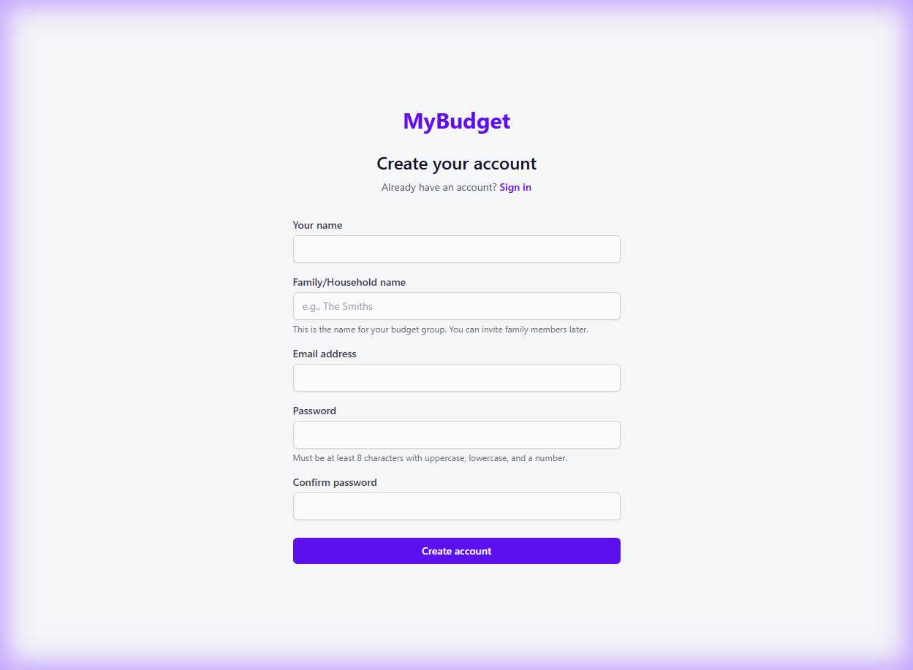
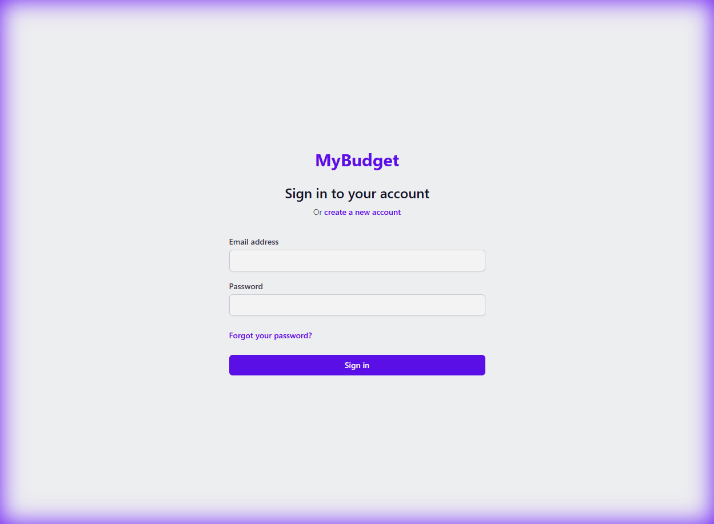

# Test Case: WTS-001 - Web Authentication Interaction

## Description
This test verifies the user experience during sign-up and sign-in, specifically focusing on visual feedback, form validation, and successful navigation.

## Pre-conditions
- The web application is accessible at `http://192.168.1.235:5173`.
- The backend server is running at `http://192.168.1.235:3000`.

## Detailed Test Steps

### 1. Account Registration (Sign Up)
1.  **Navigate** to `http://192.168.1.235:5173/register`.
2.  **Observe**: You should see a form asking for Name, Email, family Name, and Password.
3.  **Invalid Input Check**: Click "Register" without filling in any fields.
    -   **Expected Result**: Red error messages should appear under required fields (e.g., "Email is required").

4.  **Fill Data**: Enter a unique email, a name, a family name, and a password (at least 8 characters).
5.  **Submit**: Click "Register".
    -   **Expected Result**: The page should redirect you to the Dashboard (`/dashboard`). A "Registration Successful" toast message might appear.

### 2. User Login
1.  **Logout** (if logged in) or navigate to `http://192.168.1.235:5173/login`.
    -   **Observe**: You should see the login form.

2.  **Invalid Credentials**: Enter the email you just registered but with a **wrong password**.
3.  **Submit**: Click "Login".
    -   **Expected Result**: You should stay on the login page and see an error like "Invalid email or password".
4.  **Correct Credentials**: Enter the correct email and password.
5.  **Submit**: Click "Login".
    -   **Expected Result**: Successful login and redirection to the Dashboard.

### 3. Persistence (Refresh Test)
1.  While on the Dashboard, **refresh the browser** (F5).
    -   **Expected Result**: You should **remain logged in** and stay on the Dashboard. You should NOT be kicked back to the login page.

---

## Novice Tester Guidance
- **What is a "Toast"?**: A small popup notification that usually appears in the top-right or bottom-right corner and disappears after a few seconds.
- **Inspect Element**: If the "Register" button seems broken, right-click it, select "Inspect", and check the "Console" tab for red error text.

## Sign-off
- **Tester**: ____________________
- **Date**: ______________________
- **Result**: PASS / FAIL
