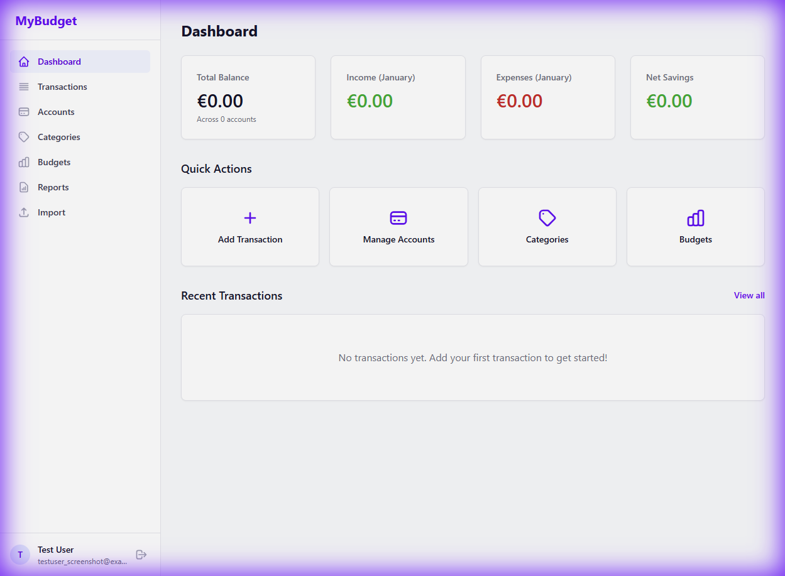
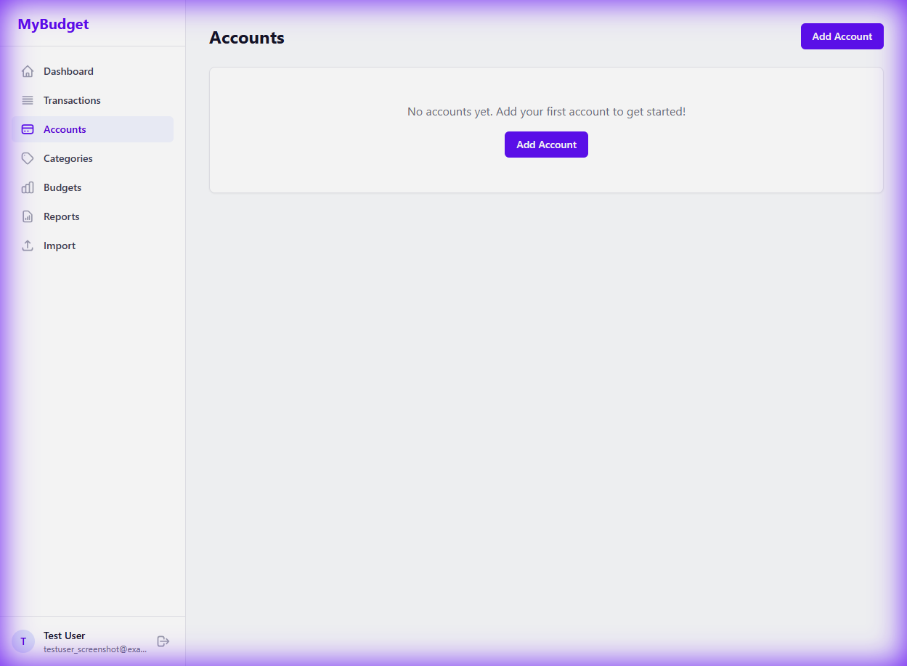

# Test Case: WTS-002 - Dashboard & Navigation

## Description
This test ensures that the main dashboard displays correct summaries and that the navigation sidebar allows moving between different sections of the app without errors.

## Pre-conditions
- User is logged in to `http://192.168.1.235:5173`.
- Some test data (accounts/transactions) exists (can be created using API scripts).

## Detailed Test Steps

### 1. Dashboard Layout
1.  **Navigate** to the Dashboard.
2.  **Verify Components**: Confirm you see the following "Cards":
    -   **Total Balance**: Should show the sum of all accounts.
    -   **Monthly Income**: Should show income for the current month.
    -   **Monthly Expenses**: Should show expenses for the current month.

3.  **Recent Transactions**: Verify a list of the 5 most recent transactions is visible.

### 2. Sidebar Navigation
1.  **Click "Accounts"** in the sidebar.
    -   **Expected Result**: URL changes to `/accounts`. The "Accounts" page loads with a list of bank accounts.

2.  **Click "Transactions"** in the sidebar.
    -   **Expected Result**: URL changes to `/transactions`. A searchable/filterable list of transactions appears.
3.  **Click "Budgets"** in the sidebar.
    -   **Expected Result**: URL changes to `/budgets`. Budget progress bars should be visible.
4.  **Click "Reports"** in the sidebar.
    -   **Expected Result**: URL changes to `/reports`. Charts (Pie/Bar) should be shown.

### 3. Responsive Design (Mobile View)
1.  **Resize the browser window** to a narrow width (like a phone).
2.  **Observe Sidebar**: The sidebar should either hide behind a "Hamburger" (three-line) menu button or collapse into icons.
3.  **Open Menu**: Click the menu button.
    -   **Expected Result**: Sidebar slides out or expands.

---

## Novice Tester Guidance
- **URL Check**: Look at the address bar in your browser. It should change (e.g., from `...:5173/dashboard` to `...:5173/accounts`) whenever you click a sidebar item.
- **Charts**: If the charts are empty, it might be because there are no transactions for the *current* month.

## Sign-off
- **Tester**: ____________________
- **Date**: ______________________
- **Result**: PASS / FAIL
