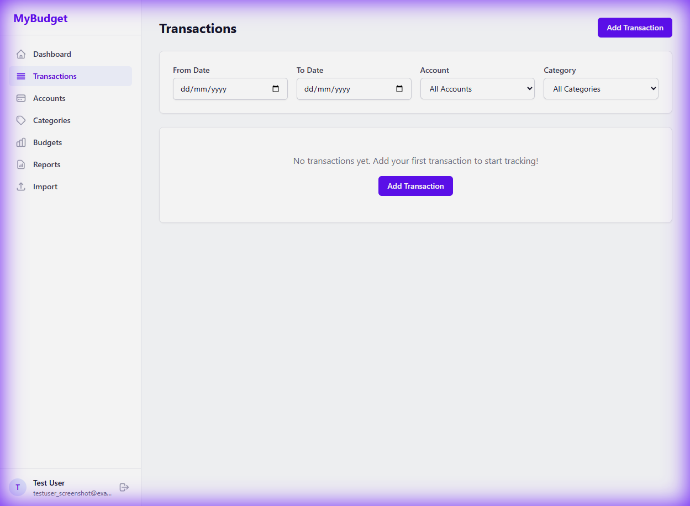

# Test Case: WTS-003 - Transaction Forms & Validation

## Description
This test focuses on the "Add Transaction" form, ensuring it handles data input correctly and prevents invalid submissions.

## Pre-conditions
- User is logged in to `http://192.168.1.235:5173`.
- At least one Account and one Category exist in the system.

## Detailed Test Steps

### 1. Opening the Form
1.  **Navigate** to the "Transactions" page.
    -   **Observe**: You should see the transaction list view.

2.  **Click "Add Transaction"** (usually a button at the top right).
    -   **Expected Result**: A Drawer or Modal (popup) opens with the transaction form.

### 2. Form Field Interactions
1.  **Type Selector**: Switch between "Expense", "Income", and "Transfer".
    -   **Expected Result**: For "Transfer", a new field "To Account" should appear. For "Expense/Income", it should be hidden.
2.  **Category Selection**: Click the "Category" dropdown.
    -   **Expected Result**: A list of categories should appear. Select one.
3.  **Date Picker**: Click the "Date" field.
    -   **Expected Result**: A calendar widget should open. Select yesterday's date.

### 3. Submission & Validation
1.  **Empty Amount**: Enter all fields EXCEPT "Amount" and click "Save".
    -   **Expected Result**: A validation message should say "Amount is required" or similar.
2.  **Successful Save**:
    -   Enter `50.00` in Amount.
    -   Select any Account.
    -   Enter "Lunch" in Payee/Description.
    -   Click "Save".
    -   **Expected Result**: The form closes. The new transaction "Lunch" appears at the top of the transaction list.

### 4. Search & Filter
1.  **Search Bark**: Type "Lunch" into the search bar.
    -   **Expected Result**: Only the "Lunch" transaction (and others with that name) should be visible.
2.  **Reset**: Clear the search bar.
    -   **Expected Result**: All transactions reappear.

---

## Novice Tester Guidance
- **Modal**: A window that pops up over the main page, dimming the background.
- **Drawer**: A panel that slides out from the side of the screen.

## Sign-off
- **Tester**: ____________________
- **Date**: ______________________
- **Result**: PASS / FAIL
